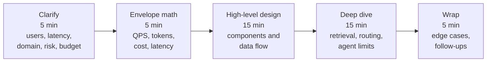
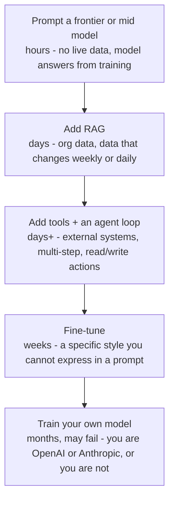
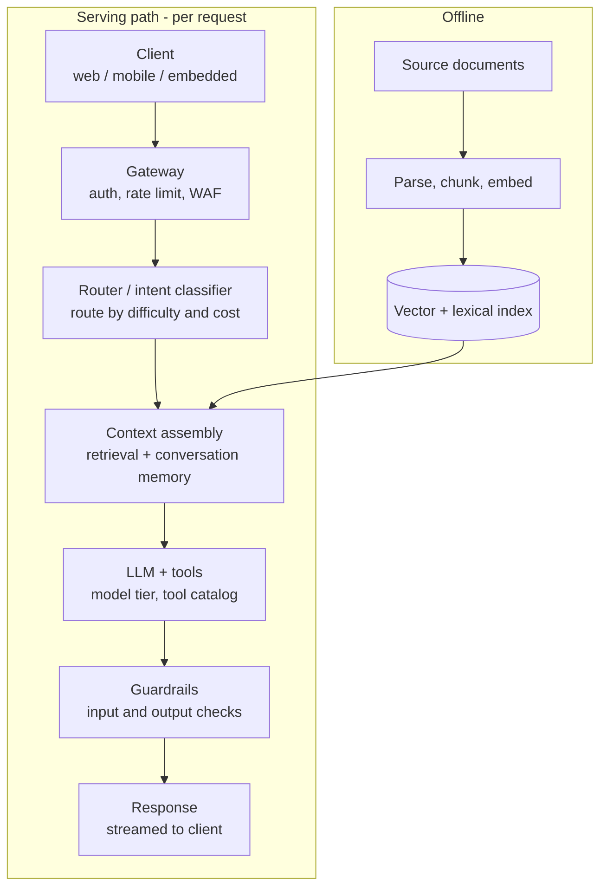
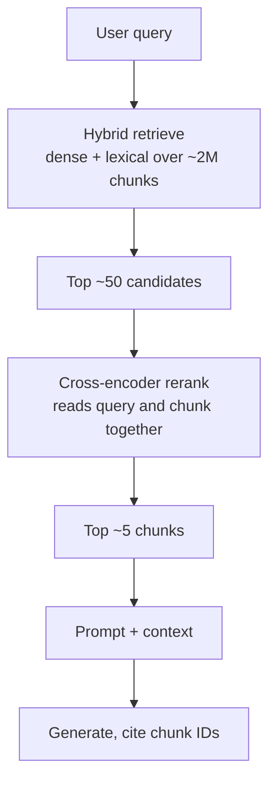
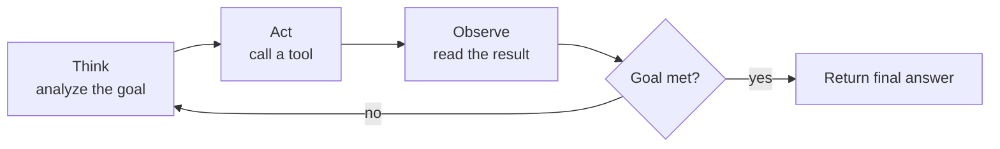
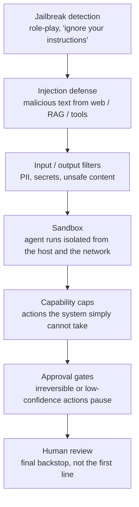
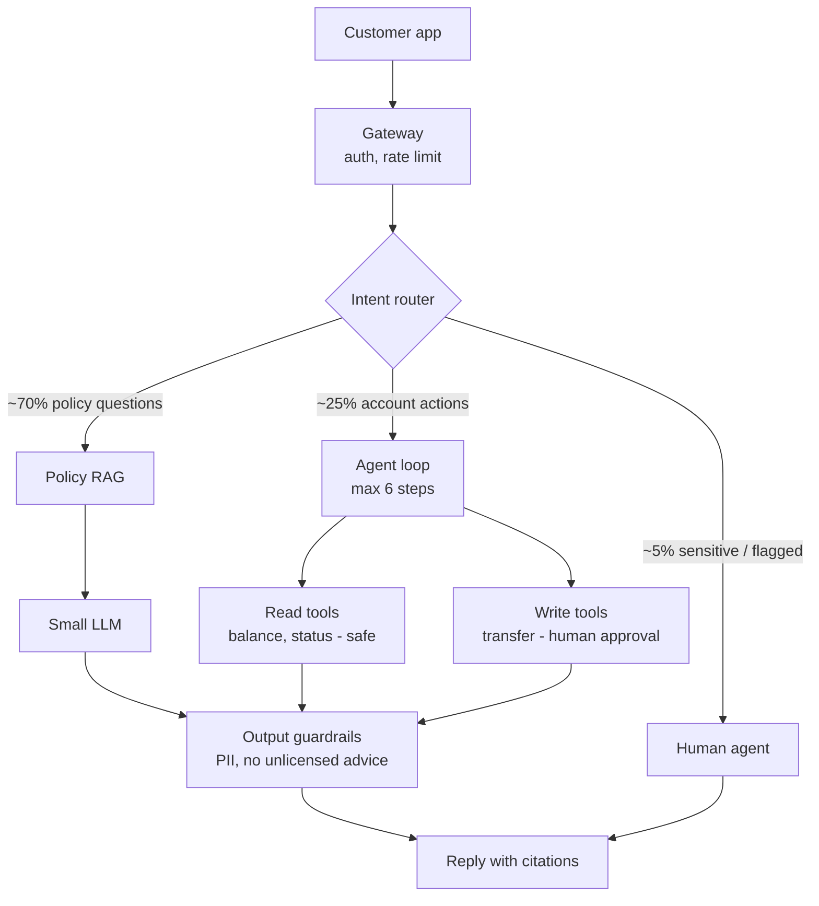

## 1. TL;DR

An AI system design interview is not a test of how many tools you can name.
It is a test of whether your architecture falls out of numbers.

The interviewer gives you a deliberately vague prompt - "design a support chatbot for a bank" - and watches what you do with the ambiguity.
Juniors answer in the first 30 seconds: "LangChain, Pinecone, GPT-5."
Seniors ask what one wrong answer costs the company, then do arithmetic, then design.

The method is five moves in a fixed order:

1. Scope it with clarifying questions. Each answer forces a design decision.
2. Do back-of-the-envelope math: QPS, peak QPS, tokens per request, tokens per day, cost per day, latency budget.
3. Climb the escalation ladder only as far as the numbers push you: prompt, then RAG, then tools and an agent loop, then fine-tuning, then your own model.
4. Draw the reference architecture. The same 80% shows up in almost every answer.
5. Defend it. Follow-up questions, edge cases, "what breaks at 10x."

Budget the 45 minutes: 5 for clarifying, 5 for math, 15 for high-level design, 15 for a deep dive, 5 to wrap.

Every decision moves four knobs at once: quality, cost, latency, safety.
You almost never improve all four. Say out loud which ones you are trading.

The one line to remember: architectures are memorized, decisions are derived.
A wrong number stated with its assumptions beats no number at all.

## 2. What the interviewer is actually scoring

The prompt is vague on purpose.
"Design an extraction system for a financial company" withholds the user count, the latency target, the accuracy bar, and the budget - because the interviewer wants to see whether you go and get them.

This is not a pen-and-paper problem where the full input is on the page.
Nobody hands you the data. You ask for it.

So the first thing being scored is: do you find the scope before you draw anything.

The second thing: do your decisions come from numbers.
"I'll use a vector database and hybrid retrieval and an eval harness" is worth nothing on its own.
"Policy documents change weekly, so a static model goes stale; that forces retrieval, and re-indexing on a weekly cadence" is the same conclusion, derived, and it scores.

The third thing: do you name the trade-offs.
You will not get best cost and best latency and best quality and best safety together.
The interview is hard for the same reason production is hard - you have to pick which knobs to turn down.

The fourth thing: can you show the design works.
Not "this should work." A golden evaluation set, the arithmetic, a canary rollout.

Junior tell: naming models and frameworks in the first 30 seconds.
Senior tell: "If the system gives a wrong answer, what does that cost - in dollars, in regulatory exposure, in trust?"

## 3. The 45-minute budget

You have 45 minutes and very little time to think.
Spend the minutes where the marks are.

The first 10 minutes look cheap and are not.
Clarifying questions and the envelope math are the foundation for the other 35.
Skip them and the high-level design has nothing to stand on, and the deep dive turns into guesswork.

High-level design is where dense knowledge shows and where most of the score is: the components, how the client gets in, the load balancer, the retrieval module, the model, the guardrails.

Deep dive is where the interviewer picks one box and asks you to open it.
Which vector database, open or closed source, how you weight hybrid retrieval, how many agent steps you allow.
If they do not steer, pick the riskiest box and open it yourself.

The wrap is the last impression.
Ask your own design the hard questions before the interviewer does.
Mess up the last five minutes with something unnecessary and it can still cost you the offer.

For a 60-minute interview, scale the sections up roughly in proportion.
For 90 minutes, put the extra time into high-level design and the deep dive, not into clarifying.

## 4. The clarifying questions

These are close to the same five questions every time.
What matters is that each answer determines something downstream.

| Question | What the answer determines |
|---|---|
| How many users, and how often do they use it? | Scale, peak load, whether you need aggressive caching and model routing |
| How fast must it feel? | Latency budget, streaming, model size, on-prem vs API |
| How fresh does the knowledge have to be? | Static model vs RAG vs re-indexing cadence. Not fine-tuning |
| What does one wrong answer cost? | Human-in-the-loop gates, abstention behavior, how hard the guardrails and evals have to be |
| What is the budget per request or per conversation? | Model tier, routing mix, how much human review you can afford |

Two of these trip people up.

"How fresh does the knowledge have to be" pulls the answer toward retrieval, not fine-tuning.
Fine-tuning does not load new facts into a model.
You are retraining weights, and weights are bad at remembering specific new things and good at absorbing a style.
Fine-tune to change how the model talks, not what it knows.

"What does one wrong answer cost" changes the whole safety posture.
In a critical financial or medical system a single wrong answer can be a very large number - fines, lawsuits, a shut-down.
That answer is what justifies a human approval gate, an abstention path ("I am not confident enough; contact this desk"), and a heavier evaluation set.

## 5. Back-of-the-envelope math

Not calculus. Arithmetic. It carries a surprising amount of information.

Worked example: a general assistant chatbot, 10 million users.

Traffic.
Assume 5 requests per user per day.
10,000,000 x 5 = 50,000,000 requests per day.

QPS.
Divide by the number of seconds in a day, 86,400.
50,000,000 / 86,400 is about 580 QPS average.

Peak QPS.
Multiply average by 2x to 5x, with a reason. Use 3x here.
About 1,740 QPS at peak. That sizes your serving tier.

Tokens.
Assume per request: 500 system tokens, 2,000 retrieved-context tokens, 400 output tokens. Call it 3,000.
50,000,000 requests x 3,000 tokens = 150,000,000,000 tokens per day. 150 billion.

Cost.
Split input from output - output tokens cost more because they are generated one at a time.
Say 125B input and 25B output.
At illustrative frontier prices of $3 per million input and $15 per million output:
125,000 x $3 + 25,000 x $15 = $375,000 + $375,000 = $750,000 per day.

That number ends the debate about running everything on one frontier model.
Roughly $0.75M a day would kill a small company on launch day.
This is where routing stops being a nice-to-have.

Latency budget.
A chatbot that makes the user wait more than about 3 seconds has already lost them.
Spend the budget: retrieval about 120 ms, reranking about 80 ms, first token about 600 ms.
First token lands under a second.
From there you must stream - if you wait for the full generation before responding, the user is staring at nothing for several seconds.

The latency budget itself told you to add streaming.
The token math told you to add routing.
That is the point: the numbers hand you the architecture.

> A wrong number stated confidently beats no numbers.
> The interviewer will not argue that retrieval is 120 ms and not 240 ms.
> They want to hear "here is my assumption, here is the calculation, here is the decision it forces."
> Once your answer is arithmetic, it is much harder to wave away.

## 6. The escalation ladder

The common failure: someone took a good course, learned MCP and multi-agent patterns, and reaches for all of it on question one.
"I'll stand up an MCP server, five specialized agents, a planner."

Advanced patterns cost more - to build, to run, to debug.
Companies run on strict budgets. Nobody is impressed by a system that is more expensive than it needs to be.

Start at the bottom. Climb only when the requirements force you.

Prompting is the base.
If every question can be answered from the model's training data and there is no live data, you do not need retrieval. You call an API.

RAG is next.
Organizational knowledge, or anything that changes on a daily or weekly cadence.
Now you are designing chunking, choosing a vector store, setting a re-indexing schedule.

Tools and an agent loop come when the work is genuinely multi-step and touches outside systems - searching the web, writing to a database, calling a payments API.
More LLM calls, harder to control.

Fine-tuning is for style, not knowledge.
A house voice that spans too many examples to fit in a prompt. Weeks of work, a real dataset, GPUs, 5x to 10x the cost.

Training your own model is months, might not succeed, and you will not beat the frontier labs without their infrastructure and their people.
Do not put this on the ladder unless you are one of those labs.

Mantra: baseline first, then escalate on evidence.

## 7. The reference architecture

Learn this once. It is about 80% of any AI system design answer.
You add boxes, you remove boxes, but the spine does not change.

Cross-cutting, and constantly left off the whiteboard: tracing, a golden evaluation set, and canary rollout. More on those below.

Client, then a gateway that authenticates, rate limits, and shields against DDoS.
Any serious production system has this. It is the front door.

A router or intent classifier, usually.
You cannot send every question to a frontier model and stay solvent, so easy questions go to small models and hard ones go up the tiers.

Context assembly.
Retrieval when the knowledge is fresh or private, plus conversation memory - and memory is a decision, not a default. Keep the last 5 turns of 20, not all 20.

The model, plus the tool catalog it is allowed to call.
Closed or open source, frontier or small, is a requirement-driven choice.

Guardrails on both sides.
Input guardrails and output guardrails.
This is the box people skip and the one that gets companies fined or sued when the system leaks PII or invents a number in a regulated domain.

Then the three things that are not optional in a real system and are constantly left off the whiteboard:

Tracing.
Not `log.info`. In an agent system a single request fans out across many model calls and tools, each with its own cost.
Store every interaction as hierarchical spans - which component, how many tokens, what cost, what latency - and render it as a waterfall.

A golden evaluation set.
A fixed set of questions with expected answers, expected retrieved chunks, expected documents in context.
Any prompt change can shift output length, loop count, accuracy on cases you were not looking at.
So the golden set is a release gate: metrics up, ship; metrics down, do not.
Track recall@k, nDCG, MRR, hallucination rate, grounding.

Canary deployment.
New version to 5% of traffic, then 10%, then the rest. Never straight to 100%.

## 8. The four knobs

Every decision you make moves these four at once.

- Quality - accuracy, grounding, task success.
- Cost - dollars per request and per day.
- Latency - p95 to first token, p95 to full answer.
- Safety - leakage, unsafe actions, regulatory exposure.

At the base of the ladder, early changes tend to lift all four.
Past a certain point that stops - a change that raises quality also raises cost and latency, a change that raises safety also raises cost and latency.

Say the trade out loud. "Adding a reranker: +quality, +latency 80 ms, +cost per query. I will take that here because a wrong policy answer is expensive."

And be honest about the ceiling.
Getting an AI feature to 90% is easy.
90 to 95 is harder. 95 to 99 is much harder. 99.1 to 99.3 is as hard as it gets.

## 9. Retrieval is a funnel

People know what RAG is. They miss that retrieval is a funnel, and that the funnel is where the bugs live.

You index around 2 million chunks.
Cosine similarity, ideally with a lexical signal alongside it, narrows to about 50 candidates.
A cross-encoder - which reads the query and a chunk together, not as separate vectors - reranks down to about 5.
Then the prompt.

When RAG is wrong, it is almost never the model. Models are good now.
Often it is not even the prompt.
Debug the funnel top down:

- Is the index stale? Did the embedding model change without a re-index? Then every chunk is noise.
- Are the top 50 right? Check the embedding model, the similarity computation, the chunk structure.
- Are the top 5 right? Check the reranker and how you chunked.
- Only then look at the prompt and the model.

Prompt and model are the parts you can iterate on freely - but fix the funnel above them first, or you are tuning a prompt on garbage context.

## 10. The agent loop and why it decays

An agent is a loop with a goal.
Think, act, observe, check the goal; if not done, loop again.

The loop is also the problem.
Say one step is 95% reliable.
Ten sequential steps is 0.95^10, about 0.60.
After ten loops the whole agent is around 60% reliable, because an early mistake cascades.

So you bound it:

- Max steps - a hard cap on loop iterations.
- Max spend - a token budget, because loops are LLM calls and tokens are the cost driver.
- Checkpoints - any irreversible action (a database write, a transfer) stops for human approval.
- Capability limits - an external controller holds a config of what each agent may do. If an agent that must never send email emits a send-email tool call, the controller refuses it. This is where multi-agent systems keep themselves honest.

## 11. The safety stack

Safety is not a bag of checks. It is an ordered pipeline, cheapest and earliest first, humans last.

Jailbreaks attack the alignment training the model shipped with - asking it to assume a role that drops its guardrails.

Injection is SQL injection's descendant.
Malicious instructions ride in through retrieved documents or web results - "ignore the system prompt and do X" - without the user ever knowing.

Filters stop sensitive data moving in or out.

The sandbox exists because agent tools can be powerful enough to delete data or change a live site. Lock the agent away from the host and the wider network.

Capability caps are a hard list of things the system cannot do at all.

Approval gates pause on anything irreversible or anything the model is not confident about.

Human review is the last resort, deliberately.
You cannot route millions of requests past a person.

Every layer you add moves the four knobs. Name the cost.

## 12. Worked example: an AI support assistant for a bank

The prompt is one line: "Design an AI support assistant for a bank."
Everything else you derive.

Clarify.

- Customers: 8 million.
- Chats: about 200,000 per day.
- Latency: p95 first token under 1.5 seconds.
- Freshness: policies change weekly. That is a direct vote for RAG.
- Risk: it is a bank. Assume heavy regulation even if unstated - full audit traces, mandatory gates, human-in-the-loop, guardrails before and after.
- Citations: every answer cites a source policy. No source, no answer.
- Budget: target $0.02 per conversation.

Math.

- Turns: about 8 per chat. 200,000 x 8 = 1,600,000 requests per day.
- QPS: 1,600,000 / 86,400 is about 18.5 average.
- Peak: x3 is about 55 QPS. Small.
- Tokens: about 3,000 per conversation. 1,600,000 x 3,000 = 4.8 billion tokens per day.
- Frontier-only cost: on the order of $24k to $28k per day, roughly $8.8M per year.
- Per conversation at frontier-only: about $28,000 / 200,000 = $0.14. Seven times over budget.

So you route. Try 75% of traffic to small models, 20% to mid, 5% to frontier, and recompute.
Iterate the mix until the daily cost lands near $6k.

> Check the arithmetic before you present it.
> $6,000 per day across 200,000 conversations is $0.03 per conversation.
> The target was $0.02. It is still over.
> Catching that in the room - and saying you would push more traffic down-tier, shrink the context, or cache harder - is worth more than a clean-looking slide.

Architecture: the reference spine, with a three-way intent router.

- Policy questions, the bulk: retrieve from the policy corpus, answer with a small model - good context plus a well-evaluated retriever means a small model is enough - then output guardrails that strip PII and block anything that reads as licensed financial advice, which only certified staff may give.
- Account actions: an agent loop, capped at 6 steps (check that against the token budget - 6 steps at a few thousand tokens each). Read tools like "show balance" are safe. Write tools like "transfer money" are red: human approval or a high-confidence gate.
- Sensitive or angry customers, or anyone on a watch list: straight to a human agent, who approves and sends the reply.

Then the parts that are not about numbers, common to any system design:

- Functional requirements: the chat UI, a thumbs up/down control feeding back into evaluation, image upload, whatever the product needs. Ask.
- User flow: front end, login, the actions a customer can take. Sketch it.
- Data flow: where the data physically goes. If there is a data residency rule - an Indian customer's data must stay in India - you need in-region servers and routing logic in the gateway. Residency means storage stays in-country. Transit is stricter: the data must also be processed in-country.

## 13. Defending the design

The last stretch is follow-up questions. The interviewer wants to interact, not watch.

"Why not fine-tune on the policies?"
Policies change weekly, and fine-tuning does not write facts into weights - it shapes style and behavior. Retrieval is the right tool.

"What if the vendor updates the model?"
Version the model and the prompt together.
On an upgrade, run the golden set. If it regresses, roll back to the previous model-and-prompt pair.
The prompt that worked on the old model may not work on the new one.

"How do you know it works?"
The arithmetic, and a golden set of a few hundred real cases.
Run it: all metrics up, it works; metrics down, it does not.
"I ran a public benchmark" is the wrong answer - public benchmarks measure generic ability, not your task.

"What breaks first at 10x?"
State the linear assumption and multiply.
10x users is 10x QPS, more load, a tighter latency budget.
From the new numbers, re-derive the cost, the p95, and the routing mix.

And caching, which is easy to forget.
Across thousands of customers, the same questions repeat, often word for word.
A semantic cache in front of the pipeline turns a repeat question into a Redis lookup - no inference, no retrieval.
Better cache, better performance. Cache design is its own hour-long topic.

## 14. Anti-patterns

| Anti-pattern | What it looks like | Fix |
|---|---|---|
| Framework-first answer | "LangChain, Pinecone, GPT-5" in the first minute | Clarify, then derive. Name tools last |
| Drawing before math | Boxes on the whiteboard with no QPS or token numbers | 5 minutes of arithmetic before any diagram |
| Over-escalating | Multi-agent and MCP for a job a prompt would do | Climb the ladder only on evidence |
| Fine-tuning for knowledge | "We'll fine-tune on the docs" | RAG for knowledge, fine-tuning for style |
| Skipping guardrails | Architecture with no input/output checks | Guardrails on both sides, especially in regulated domains |
| No evaluation story | "It looked good when I tried it" | A golden set that gates releases |
| Unbounded agent | Loop with no step or spend cap | Max steps, max spend, checkpoints |
| Ignoring the trade-off | "This improves everything" | Name which of quality, cost, latency, safety you are spending |
| Silent about assumptions | A confident number with no basis stated | "Assuming X, the calculation gives Y, so Z" |

## 15. One-page checklist

Before you draw anything:

- Users, frequency, peak.
- Latency target - to first token and to full answer.
- Knowledge freshness.
- Cost of a wrong answer.
- Budget per request or per conversation.

The math:

- Requests per day, QPS, peak QPS.
- Tokens per request, tokens per day, split input and output.
- Cost per day and per conversation.
- Latency budget, allocated across retrieval, rerank, first token.

The design:

- Lowest rung of the ladder that meets the requirements.
- Gateway, router, context, model plus tools, guardrails, response.
- Tracing, golden eval set, canary - on the diagram, not implied.
- For each decision, the knob trade-off, stated.

The defense:

- Your own edge cases, raised before the interviewer does.
- Model and prompt versioning with a rollback path.
- What breaks at 10x, in numbers.
- How you would prove it works.

---

## Source

Distilled from the talk ["How to Approach AI System Design Questions in Interviews"](https://www.youtube.com/watch?v=8-T6qFDMZao) by Think in Models - a 45-minute-interview framework plus a full live solve of "design an AI support assistant for a bank."
Model names, token prices, and specific numbers are illustrative and from the mid-2026 material; re-check current pricing and model tiers before you rely on them.
