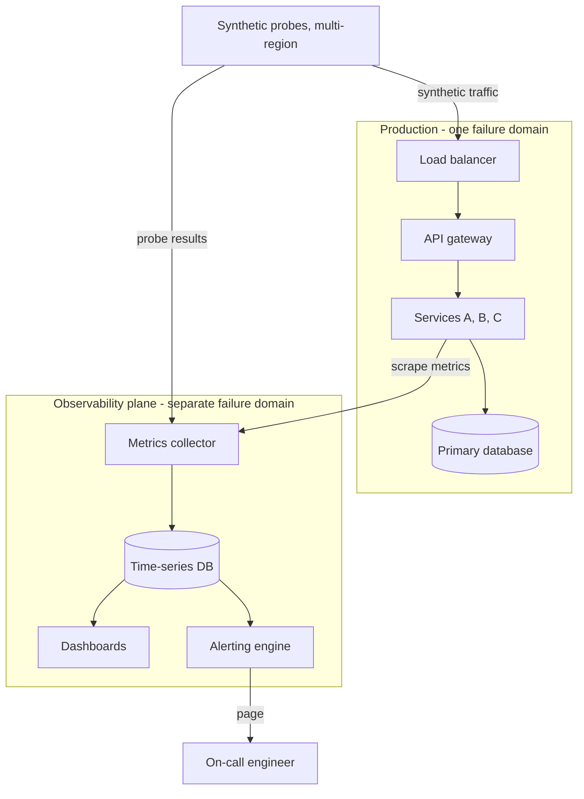
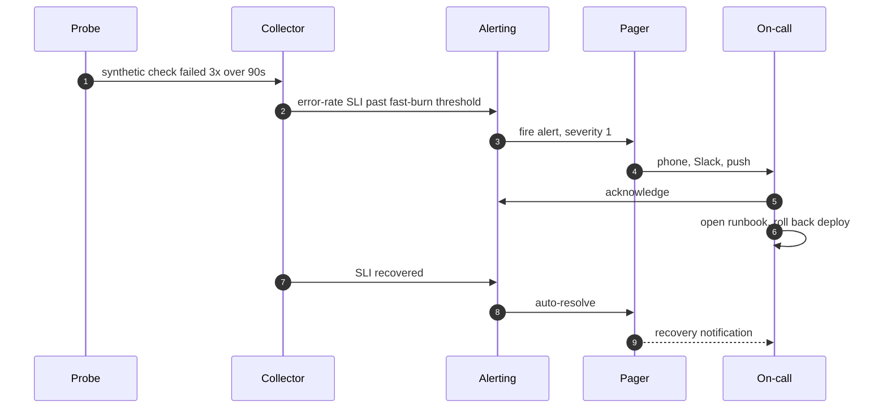
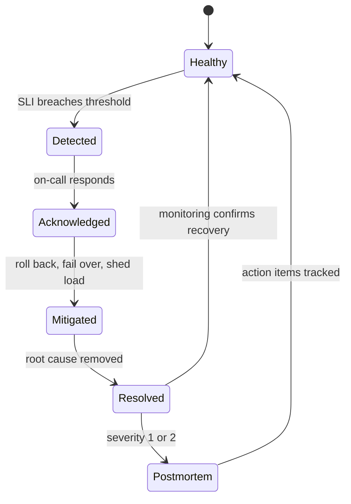

## 1. TL;DR

An outage nobody detects is worse than an outage everyone can see, because the clock on user trust starts when the system breaks, not when you notice.

Monitoring for outages is a system-design decision, not a dashboard you bolt on at the end.

The rules that hold up in production:

The monitoring plane must live in a separate failure domain from the system it watches.
If they share a region, a database, or a deploy pipeline, they fail together and you go blind exactly when you need to see.

Measure user-visible symptoms first.
The four golden signals are latency, traffic, errors, and saturation; everything else is a supporting detail.

Turn signals into SLIs, wrap SLIs in SLOs, and let the error budget decide when to ship features and when to stop and fix reliability.

Probe from where your users are.
Synthetic checks from multiple regions catch outages that a health check inside your own network never will.

Alert on symptoms and on SLO burn rate, not on causes.
Every page should be urgent, actionable, and traceable to something a user feels.

Keep an incident history.
A timestamped, queryable record of every past outage is what makes the next one shorter.

Postmortems are blameless and produce tracked action items, or they are theatre.

Build versus buy is a real fork: run Prometheus and Grafana for white-box depth, use a hosted platform for global black-box coverage you do not have to operate, and expect a mature setup to run both.

Checklist:
- The monitoring plane survives the failure of the thing it monitors.
- Every alert maps to a user-visible symptom.
- Every SLO has an owner and a defined error budget.
- Every past outage is one query away.

## 2. Why microservices make outages hard to see

A monolith has one obvious question: is the process up.

A microservice architecture trades that single question for dozens.
Each service has its own deploy cadence, its own dependencies, its own database or cache, and its own way to fail.
The system is more resilient in theory, because the comments service can die without taking checkout down, and less observable in practice, because now you have to know the state of the comments service, the checkout service, and the twelve things between them.

The failure modes multiply:

- Partial outages, where one region or one shard is broken and the global health check still says 200.
- Grey failures, where a service is up but slow enough that everything downstream times out.
- Cascading failures, where a slow dependency exhausts a thread pool and the outage spreads upstream against the direction of the request.
- Dependency outages you do not own, where a payment provider or a managed queue degrades and your error rate climbs for reasons your logs barely explain.

The core problem is visibility.
You cannot manually check dozens of services across several regions on any useful interval.
The design question is how to make the health of the whole system observable from one place, continuously, without that place being part of the same blast radius.

## 3. What to measure: symptoms before causes

Start from the user and work inward.

Black-box monitoring asks the question a user would ask: can I load the page, does the API answer, is the answer correct and fast.
It runs from outside the system and needs no knowledge of the internals.
It is what tells you there is an outage.

White-box monitoring uses internal signals: queue depth, GC pauses, connection-pool saturation, per-endpoint error rates, cache hit ratio.
It is what tells you why.

You need both, and you should wire up black-box first, because it is the layer that catches the outage you did not predict.

The four golden signals are the short list to instrument for every service:

| Signal | Question it answers | Example metric |
|---|---|---|
| Latency | How slow are requests | p50, p95, p99 response time, split by success and error |
| Traffic | How much demand | requests per second, concurrent connections |
| Errors | What fraction is failing | 5xx rate, timeout rate, wrong-result rate |
| Saturation | How close to a limit | CPU, memory, disk, thread pool, queue length |

Latency has to be measured as a distribution, not a mean.
A p99 of 4 seconds behind a mean of 200 milliseconds is one in a hundred users hitting an outage while the average looks fine.

Errors include more than 5xx.
A 200 response with an empty body, a wrong Content-Type, a stale cache, or a valid-looking page that is missing its main widget are all outages from the user's side.
Validate content and headers, not just the status line.

## 4. SLIs, SLOs, and the error budget

A raw metric is not a target.
You turn it into one in three steps.

An SLI, service level indicator, is a precise measurement of one aspect of the service, expressed as a ratio of good events to total events.
For example: the proportion of HTTP requests that return a non-5xx status in under 300 milliseconds, measured at the load balancer.

An SLO, service level objective, is the target for that SLI over a window.
For example: 99.9 percent of requests are good, measured over a rolling 28 days.

The error budget is what the SLO leaves you: 100 percent minus the SLO.
At 99.9 percent over 28 days, the budget is about 40 minutes of full outage, or an equivalent amount of partial degradation.

The error budget is the useful part, because it converts reliability from an argument into arithmetic:

- Budget remaining: ship features, take risks, run experiments.
- Budget spent: feature work stops, the next sprint is reliability, and the on-call load is treated as a bug.
- Budget consistently untouched: the SLO is too loose, or you are over-investing in reliability nobody asked for.

Burn rate is the speed at which you are spending the budget.
A burn rate of 1 means you will exactly exhaust the budget by the end of the window.
A burn rate of 14 means you will exhaust a month of budget in about two days, and that is what an alert should fire on, not a raw error count.

Checklist:
- Each user-facing service has at least one SLI defined as good over total.
- Each SLI has an SLO with a number and a window.
- The error budget and current burn rate are on a dashboard the team actually looks at.
- There is a written policy for what happens when the budget runs out.

## 5. Detecting the outage

Detection is a layered system.
No single mechanism catches everything, so you run several with different blind spots.

Health checks are the cheapest layer.
Split liveness, meaning the process is running, from readiness, meaning it can serve traffic.
A service that is alive but not ready should be pulled from the load balancer, not restarted.

Heartbeats and the dead man's switch cover the case where a component dies so completely it cannot even report an error.
A batch job or a cron pipeline pings an external endpoint on every successful run; if the ping does not arrive on schedule, that silence is the alert.

Synthetic probes are scripted user journeys run on a fixed interval from multiple geographic locations.
Not just a ping: log in, load the dashboard, submit the form, check the response body.
Running them from several regions is what surfaces "the site is down for Asia and fine for us-east," which a single internal check will never show.

Real user monitoring, RUM, works the other direction: it instruments actual sessions in the browser or app and reports latency and errors from real devices and networks.
Synthetics give you a clean, comparable signal; RUM gives you the truth about what users experience.

The monitoring architecture, drawn as failure domains:

The important part of that diagram is the box boundary.
The probes, the collector, the time-series store, and the alerting engine sit outside production on purpose.
If your dashboards are hosted on the same Kubernetes cluster that just fell over, you have a monitoring system that works right up until the moment you need it.

Checklist:
- Liveness and readiness are separate checks.
- Every scheduled job has a dead man's switch.
- Synthetic probes run from at least three regions and validate the response body.
- The detection pipeline shares no critical infrastructure with production.

## 6. Alerting without burning out the on-call

An alert is a claim that a human needs to act right now.
If that claim is often false, people stop believing it, and the one real page in fifty gets acknowledged and ignored.
Alert quality is a reliability feature.

The rules that keep the pager trustworthy:

Alert on symptoms, not causes.
"p95 checkout latency is past the SLO" is a symptom and always worth waking someone.
"CPU on node 7 is at 90 percent" is a cause, and if it is not affecting any SLI, it is a dashboard item, not a page.

Alert on burn rate, with multiple windows.
A fast-burn alert on a short window catches a sharp outage in minutes.
A slow-burn alert on a longer window catches the quiet 2 percent error rate that would blow the monthly budget without ever tripping a spike alert.

Give every alert a severity and a route.
Severity 1 pages a phone. Severity 3 opens a ticket. Nothing in between should page at 3 a.m.

Attach a runbook link to every alert definition.
The first thing the responder opens should not be a blank incident channel.

Configure maintenance windows.
A planned deploy or a database migration will trip threshold alerts.
Suppress the affected alerts for the window so the real signal is not buried under expected noise, and so nobody burns an hour chasing a false positive.

An alert firing end to end:

Checklist:
- Every paging alert is a symptom tied to an SLO.
- Burn-rate alerts exist at two window lengths.
- Every alert has a severity, a route, and a runbook link.
- Deploys and migrations suppress the alerts they are expected to trip.

## 7. Responding to the outage

Once the page fires, speed comes from structure, not heroics.

Mitigate before you diagnose.
Roll back the last deploy, fail over to the healthy region, shed load, or flip the feature flag off.
Root cause can wait; the user-facing outage cannot.

Classify severity early, because it decides how many people you pull in.
A severity 1 is a full or near-full outage of a core flow and gets an incident commander, a communications lead, and a scribe.
A severity 3 is one person and a ticket.

Run larger incidents with explicit roles.
The incident commander coordinates and decides, and does not also debug.
The communications lead owns the status page and the stakeholder updates.
The scribe keeps the timeline as it happens, because nobody remembers it accurately afterward.

Communicate outward on a status page that is not hosted on your own infrastructure.
"We are aware and investigating" within a few minutes buys more goodwill than a perfect root cause an hour late.

The incident lifecycle:

Checklist:
- Responders reach for mitigation before diagnosis.
- Severity is assigned in the first few minutes.
- Incidents above severity 2 have a commander who is not also debugging.
- The status page is on independent infrastructure.

## 8. Incident history and blameless postmortems

The incident is not over when the graph recovers.
The value of an outage is the record it leaves.

For every incident, capture:

- The timeline: first symptom, detection, acknowledgement, mitigation, resolution.
- How it was detected: an alert, a synthetic probe, or a customer email. If it was a customer email, that is a monitoring gap.
- Time to detect, time to mitigate, time to resolve, tracked as trends across incidents.
- Blast radius: which users, which regions, which revenue.

The postmortem is blameless by design.
The question is "what about the system let a human error turn into an outage," not "who ran the command."
People who expect to be punished hide information, and hidden information is how the same outage happens twice.

Every postmortem produces action items with an owner and a due date, tracked in the same system as regular work.
A postmortem whose actions are never done is a document that cost a meeting and changed nothing.

Over time, the incident history is a dataset.
Recurring causes, services that appear in every third incident, alerts that consistently fire late: those patterns are only visible if the outages are written down in a consistent, queryable form.

## 9. Who watches the watcher

The monitoring system has the same failure modes as everything else, and it fails at the worst possible time.

Meta-monitoring is a small, boring check that the monitoring itself is alive: scrapes are current, the alert pipeline processed a test alert in the last interval, the time-series database is accepting writes.

A dead man's switch is the cleanest version.
Configure an alert that fires unless it is continuously told not to.
The monitoring stack sends a steady heartbeat to an external, unrelated service; if that heartbeat stops, the external service pages you.
Silence becomes a signal, which is the one way to catch a monitoring system that died without the dignity to report it.

Keep the dependencies honest:

- The alerting path should not depend on the production database.
- The on-call and paging tool should be a different vendor or region than your main hosting.
- The status page should be hosted somewhere your own outage cannot reach.

## 10. Build versus buy

Three broad options, and most mature teams run a mix.

Custom scripts.
A cron job with curl and a Slack webhook gets you a first uptime check in an afternoon.
It stays cheap only while it stays small; multi-region probing, alert deduplication, escalation, dashboards, and historical data are a product, and if you keep extending the script you are now maintaining that product.

Self-hosted open source.
Prometheus for metrics and white-box monitoring, Alertmanager for routing and deduplication, Grafana for dashboards, Loki or the equivalent for logs.
Deep, flexible, no per-metric bill, and you operate all of it, including keeping it in a separate failure domain from prod.

Hosted platforms.
Datadog, New Relic, Grafana Cloud, and uptime-focused tools like Site24x7, Pingdom, or Better Uptime.
You get global probe locations, container and Kubernetes integrations, on-call and escalation, and dashboards without running the watcher yourself; you pay per host or per metric and your monitoring data lives with a third party.

A common shape that works:

- Prometheus and Grafana, self-hosted, for white-box metrics and internal dashboards.
- A hosted uptime tool for external, multi-region black-box probing, deliberately outside your infrastructure.
- A dedicated on-call product such as PagerDuty or Opsgenie for scheduling, escalation, and the incident timeline.

The decision is not really about cost.
It is about which failure domains you are willing to own, and whether your team's time is better spent operating a monitoring stack or building the product.

## 11. A reference setup

For a service-oriented system that needs to take outages seriously:

- Golden-signal metrics exported by every service, scraped by Prometheus into a store that lives outside the production cluster.
- One or more SLIs per user-facing service, each with an SLO, an error budget, and a burn-rate dashboard.
- Synthetic probes of the top three user journeys, run every minute from at least three regions, validating response bodies and headers, hosted by a third party.
- RUM in the web and mobile clients for real-world latency and error rates.
- Multi-window burn-rate alerts as the only thing that pages; cause-level metrics on dashboards only.
- A dead man's switch from the monitoring stack to an unrelated external service.
- An on-call product with a rotation, severity levels, per-alert runbooks, and suppression for planned maintenance.
- A status page on independent infrastructure.
- A blameless postmortem for every severity 1 and 2, with action items tracked as normal work, and a quarterly read of the incident history for patterns.

Final checklist:
- The monitoring plane can survive production going down.
- Detection is layered: health checks, heartbeats, synthetics, RUM.
- Alerts are symptom-based, burn-rate-driven, and rare enough to trust.
- Incidents have roles, runbooks, and a status page.
- Every outage leaves a blameless record with tracked follow-up.

---

Written from a short brief on SRE and outage monitoring, expanded with standard site-reliability practice: the Google SRE golden signals, the SLO and error-budget model, multi-window burn-rate alerting, and blameless postmortems.
Product names and categories move fast; treat the specific vendors here as examples, not recommendations, and check current docs before you build on them.
