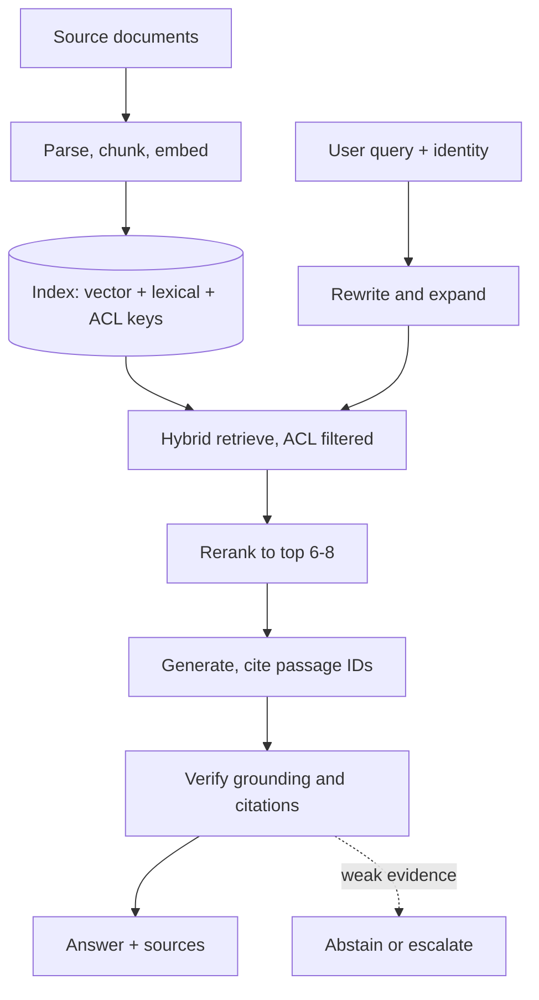
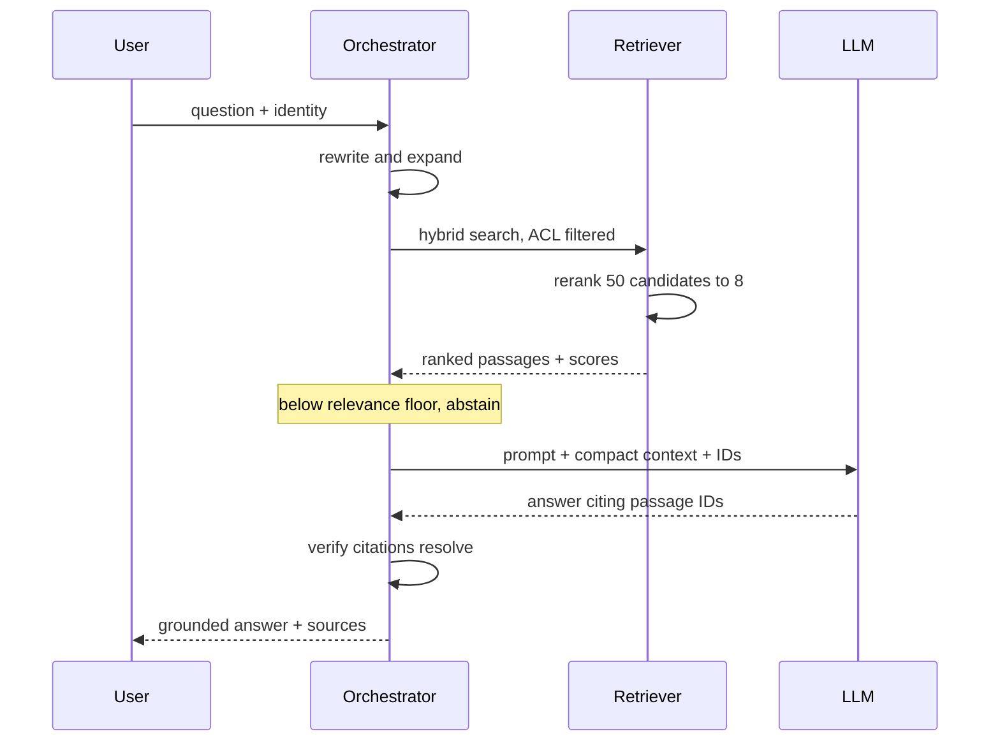
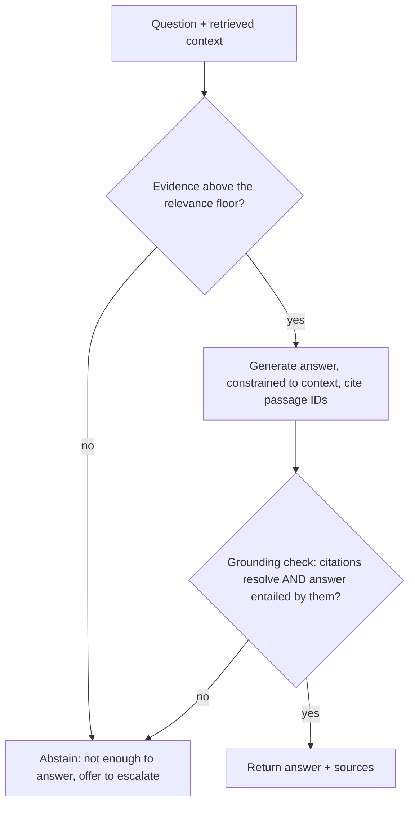
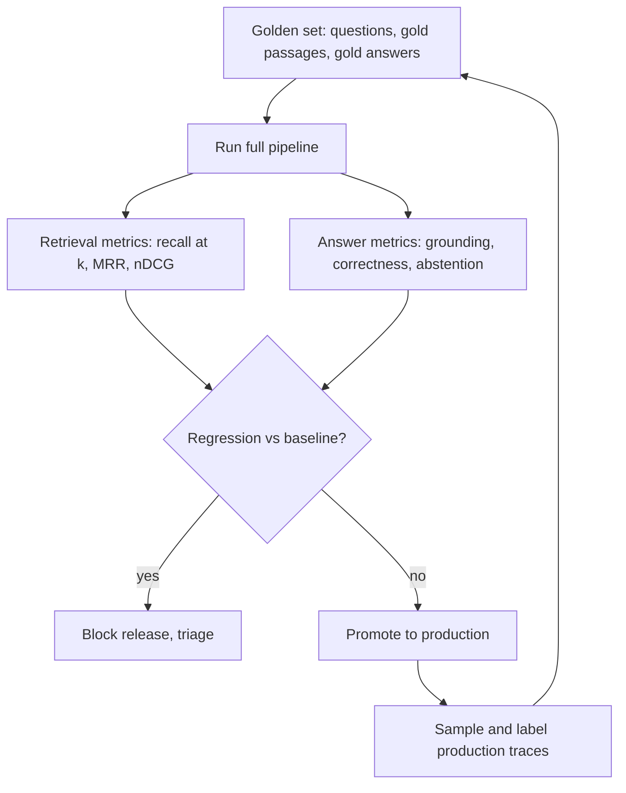

## 1. TL;DR

A demo RAG system retrieves some chunks and stuffs them into a prompt.
A production RAG system treats retrieval as a ranking problem, generation as a grounding problem, and the whole thing as an evaluation problem.

The failure you will actually hit in production is not "the model hallucinated."
It is "the right passage was in the knowledge base and retrieval never surfaced it," followed by "the model answered anyway."

Do these things:

- Own the ingestion contract: structure-aware parsing, deterministic chunking, rich metadata, idempotent re-indexing.
- Retrieve with hybrid search (dense plus lexical), over-fetch, then rerank with a cross-encoder down to a small context.
- Force grounding: the model answers only from retrieved context, cites passage IDs, and abstains when evidence is weak.
- Build a golden evaluation set before you tune anything, and gate every release on it.
- Log the full trace of every query - rewritten query, candidate IDs, scores, final context, answer, citations - from day one.
- Enforce access control at retrieval time, filtering on the user's permissions, not after generation.

Do not do these things:

- Do not chunk by a fixed character count and hope.
- Do not trust a single cosine similarity score as a relevance signal.
- Do not pass 20 chunks into the context "just in case."
- Do not measure quality by reading 10 answers and nodding.
- Do not let the same model write the answer and judge whether the answer is grounded.
- Do not ship a shared index for a multi-tenant product.

## 2. What "production grade" means here

Production grade is not a model choice.
It is a set of properties the system holds under load, under bad input, and under change.

1. Correctness you can measure.
You have a versioned evaluation set, retrieval metrics and answer metrics, and a number that moves when you change chunking, embeddings, or the prompt.

2. Grounding you can prove.
Every answer carries citations that resolve to real passages, and an automated check fails the answer if they do not.

3. Freshness you can reason about.
You know how stale the index can be, re-indexing is incremental and idempotent, and a deleted source document leaves the index within a known window.

4. Isolation you can trust.
A user can only ever retrieve what they are allowed to read, and that is enforced in the query, not in a post-filter.

5. Observability you can debug with.
When someone reports a bad answer, you can pull the full trace and see exactly which stage failed.

6. Cost and latency you can predict.
You know the p95 latency and the cost per query, and both have budgets.

If you cannot state all six for your system, you have a prototype with a login page.

## 3. The reference architecture

Two pipelines, not one.
The ingestion pipeline runs offline and is where most of your quality is decided.
The serving pipeline runs per query and is where most of your latency is spent.

Ingestion (the top branch) runs offline; serving (the query branch) runs per request.
The arrow from the index into the retrieve step is the point of the diagram: retrieval quality is a property of what you indexed, not just how you searched.

## 4. Ingestion and chunking

This stage is boring, offline, and decides more of your final quality than your model choice.

Do:

- Parse with structure awareness.
Keep headings, tables, lists, and code blocks intact.
A table flattened into prose is a table you can no longer answer questions about.
- Chunk on semantic boundaries - sections, paragraphs, function definitions - with a target size and a small overlap, then measure.
- Attach metadata to every chunk: source ID, title, section path, author, timestamp, URL, and the ACL keys that decide who can see it.
- Store a stable chunk ID derived from content, so re-ingesting an unchanged document is a no-op.
- Keep the raw source and a pointer to it, so you can re-chunk everything later without re-crawling.
- Handle updates and deletes explicitly: a tombstone for deleted sources, a re-embed for changed ones.

Don't:

- Don't split on a fixed character count with no regard for sentence or section boundaries.
You will cut a definition in half and neither half will retrieve.
- Don't drop the document structure and index a wall of text.
- Don't index boilerplate - nav bars, footers, cookie banners, repeated legal headers.
It dilutes every search.
- Don't re-index the whole corpus on every run because you did not track content hashes.
- Don't forget tables and images.
Extract tables to a readable form (markdown or key-value pairs), and caption or OCR images if they carry meaning.

Checklist:
- Chunk size and overlap are chosen from a measurement, not a default.
- Every chunk has source, section path, timestamp, and ACL metadata.
- Re-ingesting an unchanged corpus changes nothing in the index.
- Deleted sources leave the index within a known window.

## 5. Embeddings and the vector store

Do:

- Pick the embedding model with your own data and your own eval set, not a public leaderboard.
Domain match beats a small average-score advantage.
- Normalize vectors and use the distance metric the model was trained for.
- Pin the embedding model version, and treat a version change as a full re-index with a fresh eval run.
- Keep a lexical index alongside the vector index.
BM25 or its equivalent catches exact terms, product codes, error strings, and rare names that dense retrieval misses.
- Store metadata in a way you can filter on efficiently before or during the vector search.

Don't:

- Don't mix vectors from two different embedding models in one index.
- Don't use a giant embedding dimension you cannot afford to store or search at your corpus size.
- Don't rely on approximate-nearest-neighbor defaults without checking recall against an exact search on a sample.
- Don't treat the vector database as your system of record.
It is a derived index; you must be able to rebuild it from source.

## 6. Retrieval: the stage that actually fails

Most "the model is dumb" complaints are retrieval failures wearing a costume.

The pipeline that works in production has four moves: rewrite, over-fetch with hybrid search, rerank, and assemble a small context.

Do:

- Rewrite the query before retrieving.
Resolve pronouns from chat history, expand acronyms, and split a multi-part question into sub-queries.
- Over-fetch, then rerank.
Pull 30 to 100 candidates from hybrid search, then use a cross-encoder reranker to pick the 5 to 10 that actually answer the question.
- Fuse hybrid results properly - reciprocal rank fusion or a tuned weighting - rather than concatenating two lists.
- Apply the permission filter inside the retrieval query so a forbidden chunk is never a candidate.
- Set a relevance floor.
If the best reranked score is below threshold, treat it as "no good evidence" and abstain.
- Deduplicate near-identical chunks before they reach the context.

Don't:

- Don't return the raw top-k from a single vector search and call it retrieval.
- Don't trust cosine similarity as a relevance score.
Two texts can be 0.82 similar and about different things; the reranker exists because this gap is real.
- Don't stuff every candidate into the context.
More chunks means more distractors, worse grounding, higher cost, and the lost-in-the-middle effect.
- Don't retrieve once for a question that has three parts.
- Don't skip the "nothing relevant found" branch.
It is the most important path for trust.

Checklist:
- Query rewriting runs before every retrieval.
- Hybrid search feeds a cross-encoder reranker.
- A relevance threshold triggers abstention.
- ACL filtering happens in the query, not after.

## 7. Context assembly and prompting

Do:

- Give the model a compact, ordered context: fewer, higher-relevance passages, each tagged with a stable ID.
- Instruct the model to answer only from the provided context and to say when the context does not contain the answer.
- Ask for citations by passage ID inline with the claim they support.
- Put the most relevant passages at the top and bottom of the context, not buried in the middle.
- Include just enough metadata per passage - title, date, section - for the model to reason about recency and source.
- Keep a fixed, versioned system prompt and log which version produced each answer.

Don't:

- Don't paste 15,000 tokens of context and expect precision.
- Don't let the model fall back on parametric knowledge silently.
"If the context is insufficient, say so" belongs in the prompt and in the eval.
- Don't bury the instructions under the context where they get diluted.
- Don't reformat or summarize passages before the model sees them; that is where facts get dropped.
- Don't change the prompt in production without running the eval set.

## 8. Generation, grounding, and abstention

The generation step is not "call the LLM."
It is "call the LLM and then prove the answer is supported."

Do:

- Enforce an explicit abstention path and make "I don't know" a first-class, tested outcome.
- Run an automated grounding check: a separate model or an NLI check that verifies the answer is entailed by the cited passages.
- Validate that every cited ID exists in the context you actually sent.
- Return the sources with the answer, every time, so a human can verify in one click.
- Constrain the output shape when the downstream consumer needs structure, and validate it.

Don't:

- Don't let the model that wrote the answer also be the only judge of whether it is grounded.
Use a different model or a dedicated check.
- Don't treat a confident tone as a correctness signal.
- Don't silently drop citations because they make the answer look cluttered; fix the UI instead.
- Don't answer out-of-scope questions from parametric memory because it feels unhelpful to refuse.

## 9. Evaluation: the part people skip

If you cannot put a number on retrieval quality and answer quality, you are tuning by vibes and every change is a coin flip.

Build the evaluation loop before you optimize anything.

Do:

- Curate a golden set of 100 to 300 real questions, each with the passage IDs that should be retrieved and a reference answer.
- Measure retrieval separately from generation.
Retrieval recall@k tells you whether the answer was even reachable.
- Measure answer grounding, answer correctness, and abstention behavior as distinct metrics.
- Use an LLM judge with a rubric for the fuzzy metrics, but calibrate the judge against human labels on a sample.
- Run the eval in CI on every change to chunking, embeddings, retrieval, reranking, or the prompt.
- Grow the golden set from production failures so it gets harder over time.

Don't:

- Don't evaluate the answer without checking whether retrieval succeeded first.
A right answer over wrong context is luck.
- Don't rely on a single aggregate score; watch the distribution and the worst cases.
- Don't let the eval set go stale while the product moves.
- Don't trust an uncalibrated LLM judge as ground truth.
- Don't skip a baseline; "better than last week" needs last week's number.

Checklist:
- Golden set exists, is versioned, and lives in the repo.
- Retrieval and answer metrics are separate.
- Every relevant change runs the eval before merge.
- Production failures flow back into the golden set weekly.

## 10. Observability and feedback

Do:

- Log the full trace per query: original query, rewritten query, retrieved candidate IDs and scores, reranked set, final context, prompt version, model, answer, citations, latency per stage, and cost.
- Give the trace a stable ID and surface it in support tooling.
- Capture user feedback - thumbs, corrections, "this is wrong" - and link it to the trace.
- Alert on the signals that predict a bad experience: abstention rate spike, retrieval score collapse, latency p95 breach, citation-resolution failures.
- Track index freshness as a metric, not a cron job you assume ran.

Don't:

- Don't log only the final answer.
When it is wrong you will have nothing to debug.
- Don't store traces with document contents in a system that ignores the source ACLs.
- Don't ignore the slow, quiet degradation: an embedding drift, a parser regression on a new document type, a source that stopped syncing.

## 11. Security, access control, and privacy

RAG turns your knowledge base into an answer engine, which means every retrieval bug is now a potential data-exposure bug.

Do:

- Resolve the user's identity and permissions at query time and pass ACL filters into the retrieval query.
- Store per-chunk ACL keys at ingestion and keep them in sync when source permissions change.
- Isolate tenants: a separate index or a hard partition per tenant for multi-tenant products.
- Treat prompt-injected instructions inside retrieved documents as hostile.
Strip or sandbox instructions in content, and never let retrieved text change the system prompt or trigger tools without a gate.
- Redact or tokenize PII at ingestion if downstream consumers do not need it.
- Log access, and make retrieval logs auditable.

Don't:

- Don't retrieve broadly and filter results by permission afterward; a timing or a bug leaks the existence and often the content of restricted docs.
- Don't share one embedding index across tenants because it is cheaper.
- Don't pipe retrieved content straight into a tool-calling agent without treating it as untrusted input.
- Don't forget that citations and error messages can leak restricted titles and snippets.

## 12. Cost and latency

Do:

- Set a per-query cost budget and a p95 latency budget, and put both on a dashboard.
- Cache aggressively: embedding cache for repeated text, retrieval cache for repeated queries, and a full-response cache for exact repeats where staleness is acceptable.
- Right-size the models per stage: a small model for query rewriting, a reranker for precision, the large model only for the final generation.
- Retrieve and rerank in parallel with any other independent work.
- Trim the context to what the reranker says is relevant; tokens are most of your cost.

Don't:

- Don't use your largest model for query rewriting and reranking.
- Don't re-embed the corpus on a schedule when nothing changed.
- Don't let context size grow unbounded as you add "just one more" retrieval source.
- Don't ignore the reranker's own latency; pick one that fits your budget.

## 13. Common failure modes

| Symptom | Usual root cause | Fix |
| --- | --- | --- |
| Answer is wrong but the fact is in the KB | Retrieval never surfaced the passage | Hybrid search, over-fetch, rerank, check recall@k |
| Model invents details | Weak context plus no grounding check | Relevance floor, abstention path, entailment check |
| Right answer, wrong or missing citations | Citations not validated against sent context | Resolve every cited ID, fail the answer if it does not |
| Quality drops after a "small" change | No eval gate | Golden set in CI on every retrieval or prompt change |
| Stale answers | Index not incremental or deletes not handled | Content-hash ingestion, tombstones, freshness metric |
| A user sees another user's data | Post-filtering instead of query-time ACL | Push permission filters into retrieval |
| p95 latency creeps up | Context and candidate count grew silently | Budgets, caps, per-stage latency logging |
| Eval looks great, users complain | Golden set is stale or unrepresentative | Sample production traces into the golden set |

## 14. A rollout runbook

1. Define the scope: what questions this system answers, and what it explicitly refuses.
2. Build ingestion: structure-aware parsing, deterministic chunking, metadata and ACL keys, content-hash idempotency.
3. Stand up hybrid retrieval: vector index plus lexical index, fused, with ACL filtering in the query.
4. Add the reranker and a relevance threshold.
5. Write the grounded-generation prompt with citations and an abstention instruction.
6. Add the grounding and citation-resolution checks after generation.
7. Curate the golden set - 100+ real questions with gold passages and answers - before tuning.
8. Wire the eval into CI and record a baseline.
9. Add full-trace logging and the support-tooling view.
10. Load test for latency and cost; set budgets and alerts.
11. Ship to a limited audience, watch traces, and label failures.
12. Feed failures back into the golden set and iterate.

## 15. Closing checklist

- Ingestion is idempotent, structure-aware, and carries ACL metadata.
- Retrieval is hybrid, over-fetches, and reranks to a small context.
- There is a relevance floor and a tested abstention path.
- Generation is constrained to context, cites passage IDs, and is grounding-checked by a separate judge.
- A versioned golden set gates every release in CI.
- Every query emits a full trace with a stable ID.
- Permissions are enforced at retrieval time, and tenants are isolated.
- Cost per query and p95 latency have budgets and alerts.

The pattern underneath all of it: retrieval is a ranking problem, generation is a grounding problem, and the system is only as good as the evaluation set you are willing to maintain.
