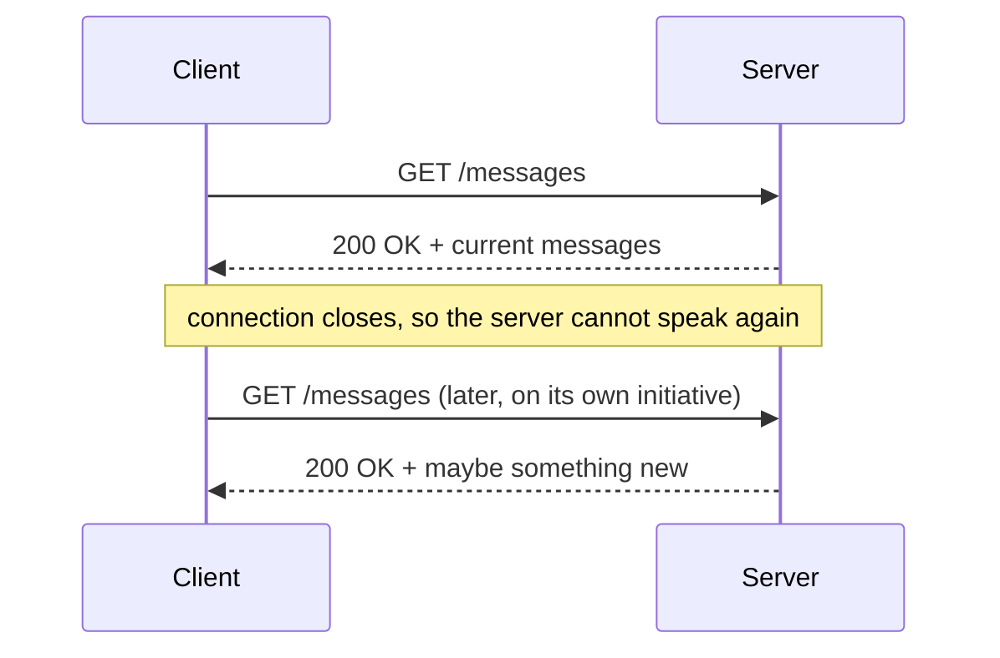
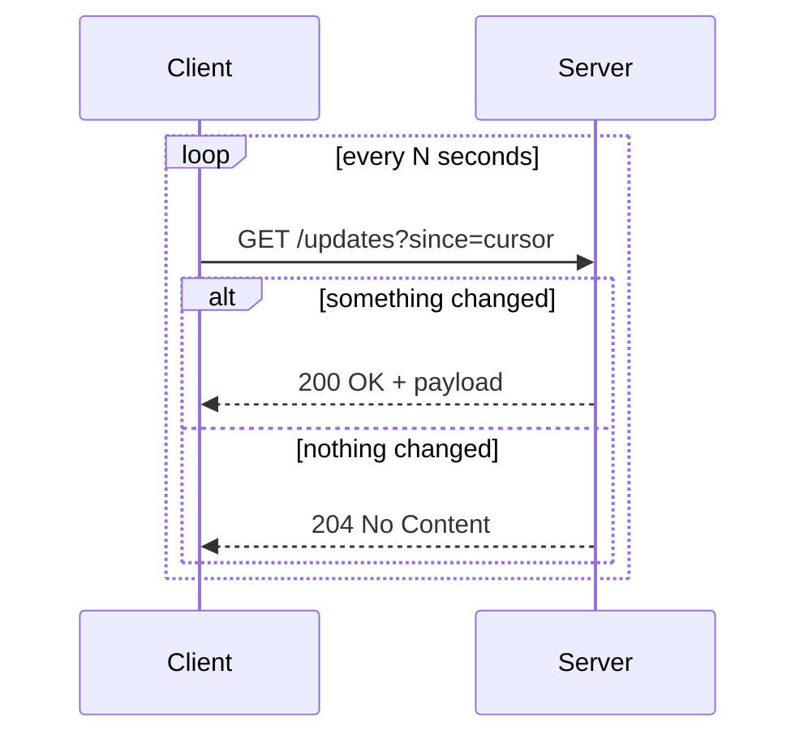
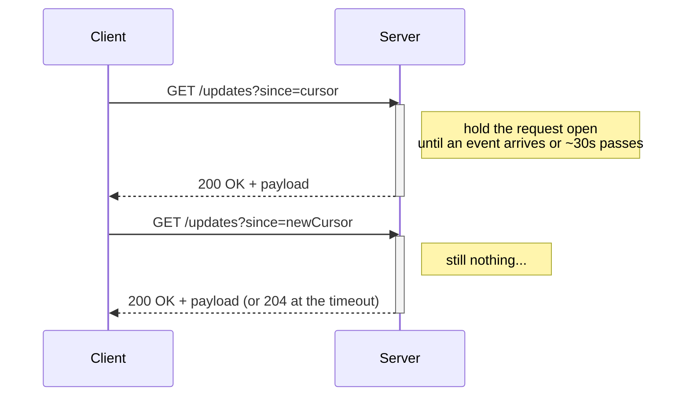
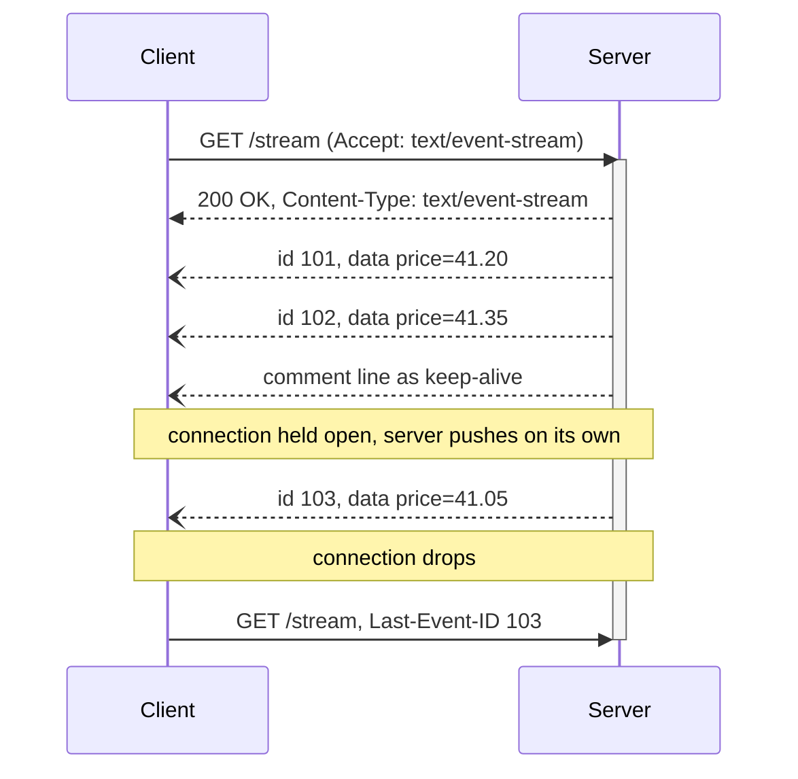
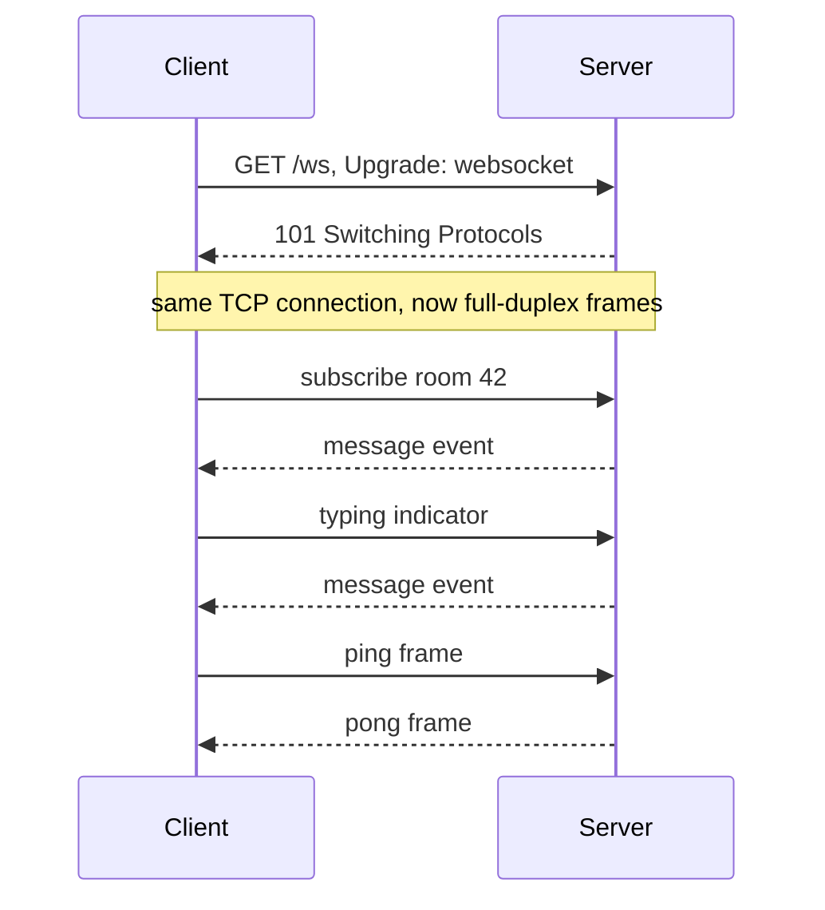
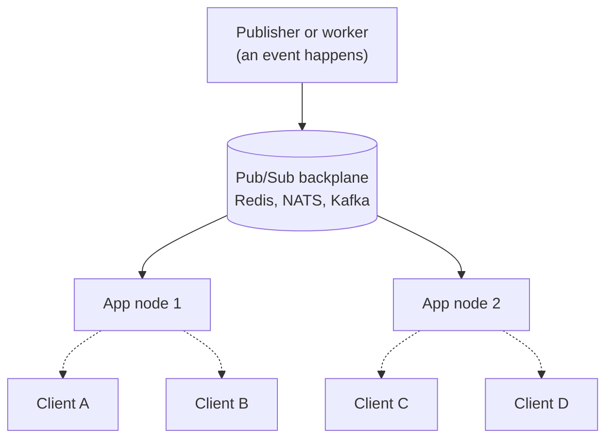
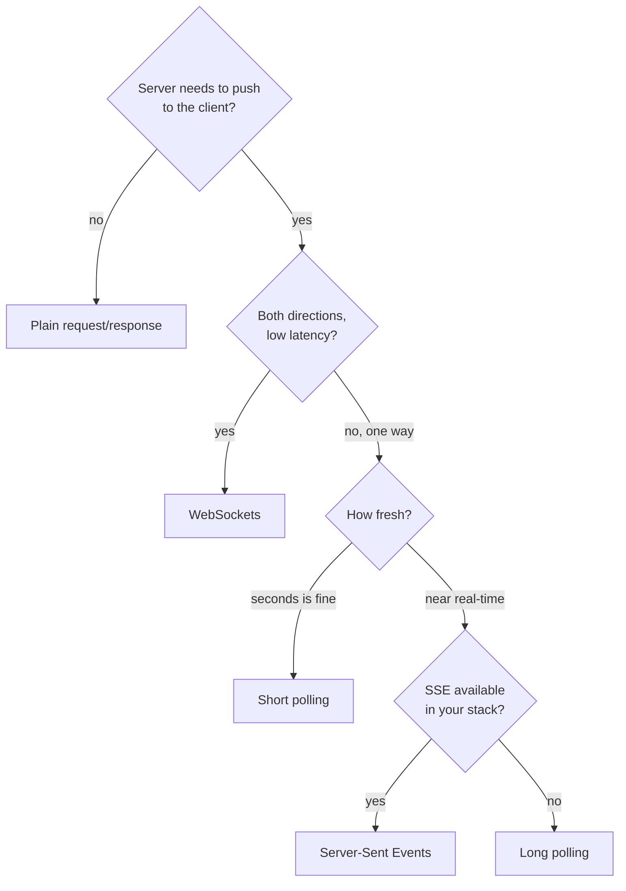

## 1. TL;DR

HTTP only speaks when spoken to.
The client asks, the server answers, the connection closes.
Every "live" feature on the web is a workaround for that one limitation.

There are four workarounds worth knowing, in rough order of how much infrastructure they cost you:

- Short polling: the client re-asks on a timer. Simplest thing that works. Wastes requests.
- Long polling: the server holds each request open until it has something to say. Near real-time, works everywhere, ties up a connection per client.
- Server-Sent Events (SSE): one long-lived HTTP response that the server keeps writing to. One direction, built-in reconnect, great for feeds and dashboards.
- WebSockets: an HTTP request that upgrades into a raw two-way socket. Lowest latency, bidirectional, and now you own reconnect, heartbeats, and scaling.

Default picks:

- Server to client only (notifications, progress, live dashboards, price ticks): SSE.
- Both directions, low latency (chat, presence, collaborative editing, multiplayer, live cursors): WebSockets.
- Tiny scale, updates can lag a few seconds, you don't want to run anything: short polling.
- Near real-time but SSE is not available in your stack: long polling.

The transport is the easy decision.
The hard part is fan-out (getting one event to thousands of subscribers spread across many servers) and the resume story (clients disconnect constantly, and they must not miss messages).
Solve those two before you ship.

Checklist:

- Pick the simplest transport that meets the latency requirement, not the most powerful one.
- Design how a client catches up after a disconnect before you write the happy path.
- Heartbeat in both directions and reap dead connections.
- Confirm your load balancer and proxies pass the transport through without buffering or timing out.
- Know your ceiling: connections per node, memory per connection, and how events fan out across nodes.

## 2. The baseline: request and response

Plain HTTP is a conversation the client always starts.



The server can have breaking news a millisecond after it answers, and it has no way to tell the client.
It has to wait to be asked again.

Everything below is a technique for shrinking the gap between "the server knows" and "the client knows", trading simplicity for freshness and trading freshness for infrastructure.

## 3. Short polling

The client asks again on a fixed interval.



The only knob is the interval.
Short interval means fresher data and more load.
Long interval means staler data and less load.

Do the arithmetic before you ship it.
Ten thousand clients polling every five seconds is two thousand requests per second, and on a quiet system almost every one of those returns nothing.
Each empty poll still pays for TLS, request parsing, auth, a database read, and a response.

Short polling is the right call when:

- The client count is small, or the interval can be long (30s, 60s).
- The data is naturally periodic anyway (a status page, a queue depth, a build result).
- You want the fewest moving parts and no long-lived connections to operate.

It is the wrong call when you need sub-second freshness or you have a large idle audience, because you pay full request cost for mostly empty answers.

```js
// client
async function poll() {
  const res = await fetch(`/updates?since=${cursor}`)
  if (res.status === 200) {
    const batch = await res.json()
    cursor = batch.cursor
    apply(batch.events)
  }
}
setInterval(poll, 5000)
```

Always send a cursor or timestamp so the server can answer "nothing since then" cheaply, and so a slow client never misses events between polls.

## 4. Long polling

The client asks, and the server does not answer until it actually has something, or until a timeout forces an empty response.
The client then immediately asks again.



From the user's point of view this is real-time.
The event reaches them the moment the server has it, not on the next tick of a timer.

The costs are on the server side:

- Every connected client holds an open request the entire time it is waiting. On a threaded server that is a tied-up worker. On an async server it is cheaper but still a live socket, a bit of memory, and a database or pub/sub listener.
- You pay full HTTP request and response overhead (headers, cookies, auth) on every cycle, which fires every time an event is delivered.
- A server restart drops every open request at once, and every client reconnects in the same second. Add jitter to reconnects.
- Load balancers and proxies have their own idle timeouts. Your hold time must sit comfortably under the shortest one, or clients get 504s instead of clean 204s.

Long polling is the compatibility choice.
It runs through anything that speaks HTTP/1.1, which is why chat systems used it for years and why it is still the fallback layer under libraries like socket.io.
Reach for it when you need near real-time delivery and SSE or WebSockets are not options.

## 5. Server-Sent Events

SSE is one HTTP response that never ends.
The client opens it once, the server holds it open and keeps writing text events into it, and the browser's `EventSource` handles reconnection on its own.



The wire format is deliberately boring.
It is UTF-8 text, one field per line, events separated by a blank line:

```
id: 103
event: price
data: {"symbol":"ACME","price":41.05}

: this is a comment, often sent every 15s to keep the connection warm

retry: 5000
```

What you get for free:

- Automatic reconnect. If the stream drops, the browser reconnects after the `retry` interval.
- Resume. The browser sends the last `id` it saw back as the `Last-Event-ID` header, so your server can replay what was missed if you keep a short buffer.
- Multiplexing on HTTP/2. The old six-connections-per-domain limit that bit SSE on HTTP/1.1 goes away once you are on HTTP/2.

The limits:

- One direction only. The server streams to the client. Anything the client wants to say goes over a normal separate request. For many features that is fine, because the client rarely needs to say anything.
- Text only. Binary payloads have to be base64-encoded, which costs you a third in size.
- Long-lived connections and buffering proxies do not mix. Some reverse proxies and older corporate middleboxes buffer the response and defeat the point. Disable response buffering on the route and send periodic comments so intermediaries keep the pipe open.
- Serverless platforms often cap how long a response can stay open.

```js
// client
const es = new EventSource("/stream")
es.addEventListener("price", (e) => render(JSON.parse(e.data)))
es.onerror = () => {
  // the browser is already retrying; just surface a "reconnecting" state
}
```

```js
// server (web-standard ReadableStream)
export function GET() {
  const stream = new ReadableStream({
    start(controller) {
      const enc = new TextEncoder()
      const send = (id, event, data) =>
        controller.enqueue(enc.encode(`id: ${id}\nevent: ${event}\ndata: ${JSON.stringify(data)}\n\n`))
      const unsub = bus.subscribe("price", (p) => send(p.seq, "price", p))
      const ping = setInterval(() => controller.enqueue(enc.encode(": ping\n\n")), 15000)
      controller.signal?.addEventListener("abort", () => { unsub(); clearInterval(ping) })
    },
  })
  return new Response(stream, {
    headers: { "Content-Type": "text/event-stream", "Cache-Control": "no-cache", Connection: "keep-alive" },
  })
}
```

SSE is the quiet workhorse for one-way real-time: notifications, activity feeds, progress bars, log tails, dashboards, LLM token streams.

## 6. WebSockets

A WebSocket starts as an ordinary HTTP GET with an `Upgrade` header.
The server answers `101 Switching Protocols`, and from that point the TCP connection is no longer HTTP.
It is a full-duplex channel carrying framed messages, text or binary, in both directions, with almost no per-message overhead.



This is the most capable option and the most work to operate.

What it buys you:

- True bidirectional messaging with the lowest latency of any option here.
- Tiny framing overhead, so high-frequency updates (cursors, game state, telemetry) are cheap once the socket is up.
- Binary support without encoding tricks.

What you take on:

- After the upgrade it is not HTTP. Caches, WAFs, and some corporate proxies do not understand it. You need infrastructure that explicitly supports WebSocket upgrades end to end.
- No built-in reconnect. When the socket drops, you reconnect, re-authenticate, re-subscribe, and replay missed messages yourself.
- No built-in liveness. TCP can hold a dead connection open for minutes. You send ping frames on an interval and close sockets that stop ponging.
- Backpressure is yours to manage. If you produce messages faster than a client drains them, the send buffer grows until something falls over. Watch buffered amount and drop or coalesce.
- Auth tokens expire. A socket that lives for hours outlives the token that opened it, so you need a refresh path over the socket itself.

```js
// client with the reconnect you have to write
function connect() {
  const ws = new WebSocket("wss://example.com/ws")
  ws.onopen = () => { authenticate(ws); resubscribe(ws) }
  ws.onmessage = (e) => apply(JSON.parse(e.data))
  ws.onclose = () => setTimeout(connect, backoff()) // exponential backoff + jitter
}
connect()
```

Use WebSockets when the interaction is genuinely two-way and latency-sensitive.
If you find yourself only ever sending from server to client, you wanted SSE.

## 7. Scaling: the part that actually bites

The transport choice is a day-one decision.
Fan-out is the one that wakes you up later.

An event happens once (a message is posted, a price moves, a job finishes) and it has to reach every subscriber.
On one server that is a loop over some in-memory list.
The moment you run two servers behind a load balancer, the subscribers for a given event are split across both, and the server that received the event has no idea about the connections held by the other one.

You need a backplane: a shared channel every app node subscribes to, so any node can publish an event and every node can deliver it to its own connected clients.



Common backplanes: Redis pub/sub (simple, no persistence), Redis Streams or Kafka or NATS JetStream (persistence and replay), Postgres `LISTEN/NOTIFY` (fine at small scale, one more thing your database does). The socket.io Redis adapter and managed services like Ably, Pusher, and Supabase Realtime are this pattern packaged up.

Other things that break at scale:

- State and stickiness. A WebSocket or long-poll hold is stateful, so either pin a client to one node (sticky sessions) or push connection state into a shared store. SSE and long polling can be genuinely stateless if the client always carries a cursor or `Last-Event-ID`, so any node can serve the next request.
- Connection ceiling per node. Each idle connection costs a file descriptor and some kernel and heap memory. Tens of thousands per node is normal, millions is a specialized system. Load balancers have their own connection limits and idle timeouts.
- HTTP/1.1 connection cap. Six concurrent connections per domain per browser. It hurts SSE on HTTP/1.1 and disappears on HTTP/2.
- Serverless. Functions bill per request and cap execution time, which is the opposite of what a connection held open for an hour wants. Run real-time on a stateful service or a managed realtime layer, not on request-scoped functions.

## 8. How to choose



| | Short polling | Long polling | SSE | WebSockets |
|---|---|---|---|---|
| Direction | both (per request) | both (per request) | server to client | full duplex |
| Latency | up to one interval | near real-time | near real-time | lowest |
| Browser API | `fetch` | `fetch` | `EventSource` | `WebSocket` |
| Reconnect / resume | trivial, cursor-based | you handle it | built in, `Last-Event-ID` | you build it |
| Binary | yes | yes | base64 only | yes |
| Proxy / infra friendliness | anything | anything HTTP | mostly, watch buffering | needs upgrade support |
| Idle server cost | low (bursty) | one open request per client | one open connection per client | one open connection per client |
| Scaling story | stateless | stateless with cursor | stateless with cursor | sticky or shared state |

Rules of thumb:

- Do not start from WebSockets. Most "real-time" features are one-directional, and SSE gives you reconnect and resume for free.
- Reach for WebSockets when the client and server genuinely talk over the same channel and every 50ms matters: chat, presence, multiplayer, collaborative editing, live cursors.
- Use short polling when the honest answer is "a few seconds late is fine" and you would rather not operate a connection layer.
- Keep long polling in your back pocket as the universal fallback.
- Evaluate a managed realtime service before you build your own gateway. The transport is a weekend. Fan-out, presence, reconnect storms, and capacity planning are the year.

## 9. Ship checklist

- The transport is the simplest one that meets the latency requirement.
- Clients carry a cursor, sequence number, or `Last-Event-ID`, and the server can replay a short window on reconnect.
- Heartbeats run in both directions and dead connections get closed, not leaked.
- Backpressure has a defined behavior: coalesce, drop, or disconnect the slow client.
- Long-lived connections handle auth token expiry without dropping.
- The load balancer and every proxy in the path pass the transport through without buffering or premature timeout.
- You have measured connections per node and know the fan-out backplane's throughput headroom.
- When the primary transport fails, the client degrades to polling instead of going dark.
