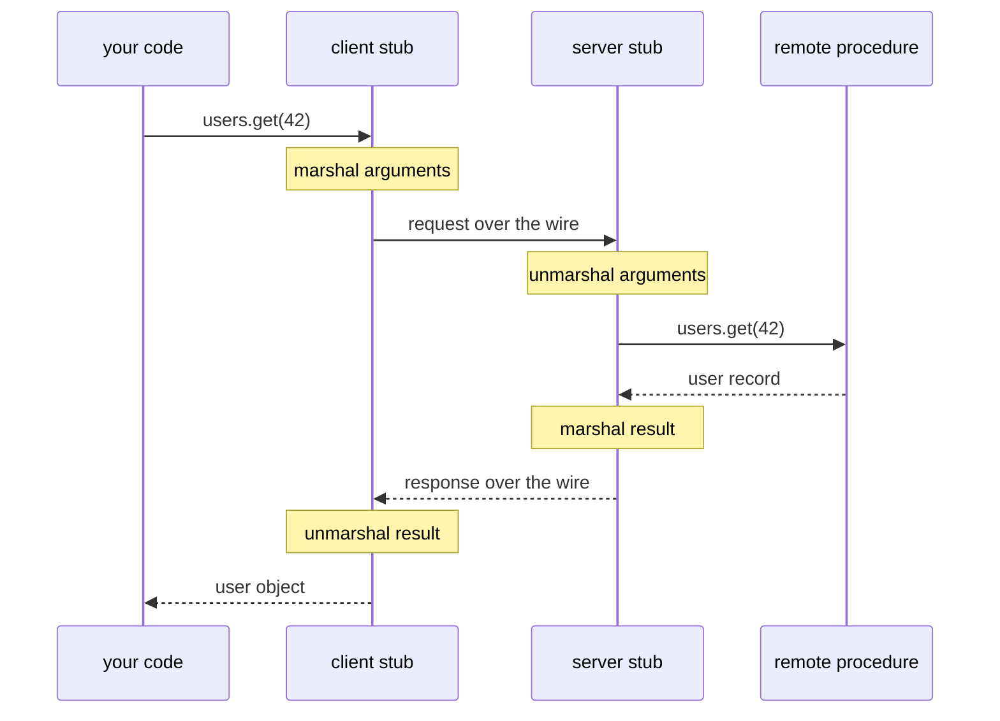
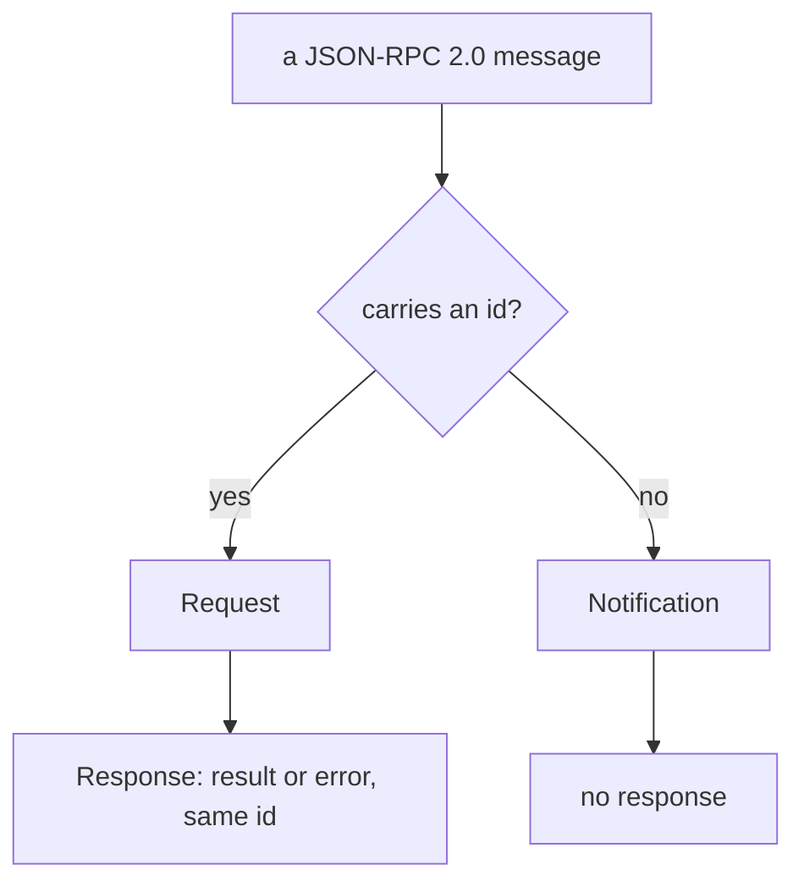
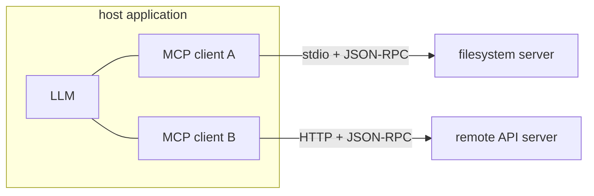
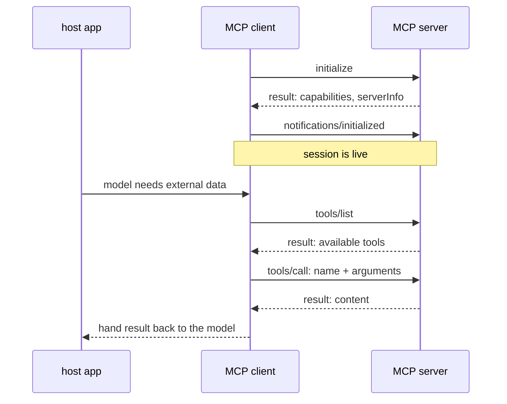
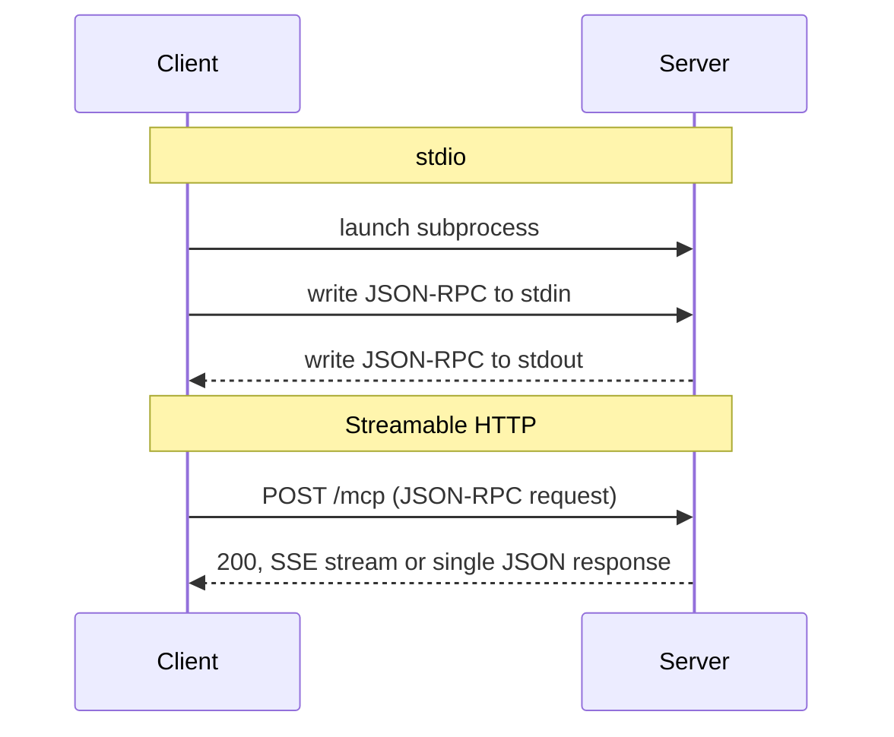

## 1. TL;DR

RPC (Remote Procedure Call) is a way to make a call across the network look like a call to a local function.
You invoke something that reads like a method, a local stub serializes the arguments, ships them to another process, waits for the reply, and hands you back a native object.
The network protocol, the retries, and the wire format stay out of your business logic.

MCP (the Model Context Protocol) is an RPC protocol.
Every message between an MCP client and an MCP server is a [JSON-RPC 2.0](https://www.jsonrpc.org/specification) message.
When a model "calls a tool," the client sends a `tools/call` request, the server runs the tool, and the result comes back as a JSON-RPC response tagged with the same id.
The method names are a small fixed catalog (`initialize`, `tools/list`, `tools/call`, `resources/read`, `prompts/get`, and a handful more), the transport is usually stdio or HTTP, and the tool schemas are discovered at runtime instead of being code-generated at build time.

The rest of this post is the general RPC picture first, then exactly where MCP sits inside it.

## 2. What is RPC?

At its core, RPC is designed to make a remote network call look and feel like a local function call.
When you write an application, you often need one service (the client) to request data or an action from another service (the server).
Traditionally that involves repetitive boilerplate: handling network protocols, serialization, retries, and error handling.
RPC abstracts those mundane complexities away so developers can focus on business logic.

The idea is old (the term dates to the early 1980s) but it has seen a large resurgence.
gRPC, Cap'n Proto, Twirp, tRPC, Connect, and JSON-RPC are all modern takes on the same shape, and they have become a default choice for service-to-service communication.

## 3. The role of stubs

One of the defining features of RPC is the use of "stubs."
When you invoke a function that is actually a remote call, the local stub acts as a proxy.
It intercepts the call, marshals (serializes) the request data into a format that can be sent over the network, and handles the communication.
On receiving a response, it unmarshals the data back into a native object your code can use directly.
This conversion happens behind the scenes, which makes the remote service feel native to the language you are working in.



The stub is the whole trick.
Everything hard about distributed communication is pushed into a generated or library-provided layer that sits between your call site and the socket.

## 4. Interface definition and generation

RPC systems typically rely on an Interface Definition Language (IDL), such as Protocol Buffers in gRPC.
You define the shape of your requests and responses in a language-agnostic file.
A generator tool then produces the client and server code for your language, whether that is Go, Java, or Python.
This gives you a strong API contract and removes the need to hand-write client libraries for every service.

Not every RPC system generates code.
JSON-RPC, for example, has no IDL at all: it standardizes only the envelope (a method name, some params, an id) and leaves the method catalog to the two parties.
This distinction matters for MCP, which sits on the no-codegen side of the line.

## 5. Advantages of using RPC

* **Developer productivity.** By hiding network complexity, RPC lets developers write code that behaves like an ordinary local function call.
* **Strong API contracts.** Clearly defined interfaces lead to more robust, predictable communication between systems.
* **Performance.** Payload compression, connection pooling, and efficient binary formats such as Protobuf often give better performance out of the box than a plain REST API.
* **Language interoperability.** Because stubs are generated from a common interface, services written in completely different languages can talk to each other with minimal effort.

## 6. Things to consider

RPC is not a silver bullet.

Network calls are inherently slower and less reliable than local ones, and a call that looks local can hide a 200ms round trip or a timeout.
Dependency management gets more involved: any change to a service definition means regenerating stubs and redeploying the affected services.
And while RPC is excellent for backend microservices, it has historically had limited direct browser support compared to REST over HTTP, which is part of why JSON-RPC and gRPC-Web exist.

## 7. A five-minute tour of JSON-RPC 2.0

MCP is built on JSON-RPC 2.0, so it is worth seeing the base protocol on its own first.

JSON-RPC is about as small as an RPC protocol can be.
Every message is a JSON object with `"jsonrpc": "2.0"` and one of three shapes.

A **request** has a `method`, optional `params`, and an `id` that is a string or a number:

```json
{ "jsonrpc": "2.0", "id": 1, "method": "users.get", "params": { "userId": 42 } }
```

A **response** echoes the `id` and carries exactly one of `result` or `error`:

```json
{ "jsonrpc": "2.0", "id": 1, "result": { "id": 42, "name": "Ada" } }
```

```json
{ "jsonrpc": "2.0", "id": 1, "error": { "code": -32601, "message": "Method not found" } }
```

A **notification** is a request with no `id`.
It is fire-and-forget: the receiver must not reply.

```json
{ "jsonrpc": "2.0", "method": "cacheInvalidated", "params": { "key": "users:42" } }
```



The error codes are borrowed from XML-RPC: `-32700` parse error, `-32600` invalid request, `-32601` method not found, `-32602` invalid params, `-32603` internal error, and the `-32000` to `-32099` range reserved for the application.

That is the entire protocol.
There is no IDL, no code generation, no transport requirement.
JSON-RPC does not even say how bytes get from A to B; you pick stdio, HTTP, WebSocket, or a raw socket yourself.
MCP makes those choices for you.

## 8. How MCP uses RPC

MCP connects an AI application to external data and tools.
The AI application is the **host** (Claude Desktop, an IDE, a CLI agent).
Inside the host, one **client** is created per connection, and each client talks to exactly one **server** (a filesystem server, a GitHub server, a Postgres server, and so on).



Every arrow between a client and a server in that picture is JSON-RPC 2.0.

### 8.1 The wire format is JSON-RPC 2.0, unchanged

The MCP specification is explicit that all messages between clients and servers **must** follow JSON-RPC 2.0, and it uses the same three message types: requests with a unique id, responses that echo that id with a result or an error, and notifications with no id and no reply.

MCP adds two small rules on top:

* The request id must not be `null` (plain JSON-RPC allows it), and it must not be reused within a session.
* JSON-RPC batching is **not** supported. It was briefly allowed in a 2025 draft and then removed, so each message is a single object.

Errors use standard JSON-RPC codes, plus a few in the reserved application range, for example `-32002` for "resource not found":

```json
{
  "jsonrpc": "2.0",
  "id": 5,
  "error": {
    "code": -32002,
    "message": "Resource not found",
    "data": { "uri": "file:///nonexistent.txt" }
  }
}
```

### 8.2 The stub is the SDK, and there is no per-server codegen

In gRPC you run a compiler over a `.proto` file and get a typed client.
MCP has no equivalent step, because the set of methods is fixed by the spec, not by each server.

The official SDKs (TypeScript, Python, and others) are the stub layer.
They give you `client.callTool({ name, arguments })` on one side and `server.registerTool(...)` on the other, and they handle framing, id correlation, capability negotiation, and error mapping.
You are still writing against an RPC stub; it just ships as a library instead of as generated code.

The part that is genuinely dynamic is the tool catalog.
A server's tools, their names, and the JSON Schema for their arguments are **data discovered at runtime** through `tools/list`, not types known at compile time.
That is a deliberate design choice: the consumer of an MCP interface is a language model deciding what to call, so the "contract" is a schema the model reads, not a header file a compiler enforces.

### 8.3 The session starts with an initialize handshake

An MCP connection is stateful.
Before any real work, the client and server negotiate a protocol version and exchange capabilities.

```json
{
  "jsonrpc": "2.0",
  "id": 1,
  "method": "initialize",
  "params": {
    "protocolVersion": "2025-11-25",
    "capabilities": { "roots": {}, "sampling": {} },
    "clientInfo": { "name": "ExampleClient", "version": "1.0.0" }
  }
}
```

```json
{
  "jsonrpc": "2.0",
  "id": 1,
  "result": {
    "protocolVersion": "2025-11-25",
    "capabilities": { "tools": { "listChanged": true }, "resources": {} },
    "serverInfo": { "name": "ExampleServer", "version": "1.0.0" }
  }
}
```

The client then sends a `notifications/initialized` notification, and the session is live.
Capabilities gate everything that follows: a client only calls `tools/list` if the server advertised `tools`, and a server only asks the client for an LLM completion if the client advertised `sampling`.



### 8.4 The method catalog

Almost everything in MCP is one of these JSON-RPC methods.

| Direction | Method | Purpose |
|---|---|---|
| client to server | `initialize` | negotiate version and capabilities |
| client to server | `ping` | liveness check |
| client to server | `tools/list`, `tools/call` | discover and invoke tools |
| client to server | `resources/list`, `resources/read`, `resources/templates/list` | read context the server exposes |
| client to server | `resources/subscribe` | ask to be notified when a resource changes |
| client to server | `prompts/list`, `prompts/get` | fetch reusable prompt templates |
| client to server | `completion/complete` | argument autocompletion |
| client to server | `logging/setLevel` | set server log verbosity |
| server to client | `sampling/createMessage` | ask the host to run an LLM completion |
| server to client | `roots/list` | ask which directories or URIs the client has granted |
| server to client | `elicitation/create` | ask the user for structured input mid-task |
| either way | `notifications/*` | progress, cancellation, `list_changed`, `resources/updated` |

Two things are worth calling out.

**RPC flows both ways.**
Most calls go client to server, but a server can also make requests back to the client.
`sampling/createMessage` is the important one: it lets a server ask the host's model to generate text without the server needing its own API key.
The client stays in control and can reject or modify the request.

**A `tools/call` request looks exactly like the RPC you would expect:**

```json
{
  "jsonrpc": "2.0",
  "id": 2,
  "method": "tools/call",
  "params": { "name": "get_weather", "arguments": { "location": "New York" } }
}
```

```json
{
  "jsonrpc": "2.0",
  "id": 2,
  "result": {
    "content": [
      { "type": "text", "text": "Current weather in New York:\nTemperature: 72°F\nConditions: Partly cloudy" }
    ],
    "isError": false
  }
}
```

Note the `isError` flag in the result.
MCP splits errors in two: protocol errors (unknown method, malformed params) come back as JSON-RPC `error` objects, while tool execution errors (the weather API was down) come back as a normal `result` with `isError: true`.
The second kind is deliberately visible to the model so it can react, retry, or tell the user.

### 8.5 Transports

JSON-RPC does not define a transport, so MCP defines two.

**stdio.**
The client launches the server as a subprocess and speaks JSON-RPC over its stdin and stdout, one JSON object per line.
`stderr` is free for logging.
This is what most local servers use, and it is the reason an MCP server can be a 40-line script.

**Streamable HTTP.**
The server runs as an independent process with a single HTTP endpoint.
The client `POST`s JSON-RPC messages to it; the server replies with either a single JSON response or a Server-Sent Events stream when it needs to push progress notifications or its own requests back.
The client can also open a standby SSE stream with a `GET`.
This replaces the older HTTP-plus-SSE transport from the first spec revision.



Either way, the bytes on the wire are JSON-RPC 2.0.
The transport only decides how those bytes are framed and carried.

## 9. RPC and MCP, side by side

| | Classic RPC (gRPC) | MCP |
|---|---|---|
| Wire format | Protobuf over HTTP/2 | JSON-RPC 2.0 over stdio or HTTP |
| Interface definition | `.proto` IDL | fixed method set in the spec |
| Stub | generated per service | SDK library, shared |
| Method catalog | defined by each service | small and fixed; tools are runtime data |
| Contract consumer | a compiler | a language model reading JSON Schema |
| Direction | usually client to server | both; servers call clients too |
| State | often stateless calls | stateful session with an initialize handshake |
| Primary audience | backend engineers | AI hosts and tool authors |

## 10. Final thoughts

RPC succeeded by standardizing communication and hiding network logistics, which lets teams scale services and write cleaner code.
MCP is a narrow, opinionated application of that same idea: take JSON-RPC 2.0, pin down a small method catalog, add a capability handshake and two transports, and point the whole thing at language models instead of other services.

If you already understand RPC, you already understand most of MCP.
The new parts are that the interface is discovered at runtime rather than compiled, that the client is a peer the server can call back into, and that the consumer on the other end of the contract is a model, not a compiler.

---

MCP details here follow the [2025-11-25 specification](https://modelcontextprotocol.io/specification/2025-11-25); see the [transports](https://modelcontextprotocol.io/specification/2025-11-25/basic/transports) and [lifecycle](https://modelcontextprotocol.io/specification/2025-11-25/basic/lifecycle) pages for the full rules.
Protocol revisions move fast, so check the current spec before relying on specifics.
